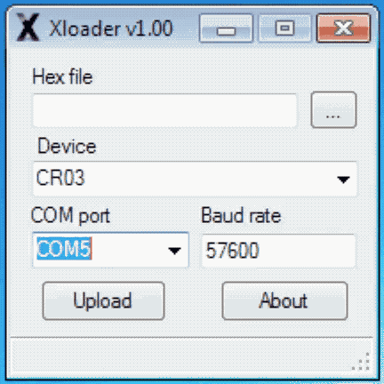

# xLoader
Microsoft Windows Tool for Flashing ☒CC01 and ☒CR03 using ☒IP01
> No tools available at this point for other Operating Systems!



### Flashing Steps: 
1. Download [xLoader.zip](https://github.com/xinabox/xLoader/releases/latest) file.
1. Virus Check the `xLoader.zip` file
1. Unzip the `xLoader.zip` file
1. Connect **☒IP01** and **☒CC01/☒CR03** together
1. Insert **☒IP01** and **☒CC01/☒CR03** into an available USB port
1. Wait for eventual drivers to be installed, if driver installation fail, goto [USB Driver](#usb-driver)
1. Execute the `xLoader.exe` file
1. Choose Firmware. There is a .hex file included in the install folder. You can also download a [specific radio ID pairs](https://github.com/xinabox/xLoader/releases/latest). 
1. Choose your COM port. If no COM port is available, goto [USB Driver](#usb-driver)
1. Click `Upload`
1. Wait for the text `Uploading...` to be replaced by `<nnnn> bytes uploaded`
1. Unplug **☒IP01** and **☒CC01/☒CR03** 

### USB Driver
If you have issues with USB drivers for the **☒IP01**, then go here [☒IP01](https://github.com/xinabox/xIP01), and install the driver from the `drivers` folder.

### Flashing on Non-Windows Operating Systems
These instructions are provided AS IS. If you encounter difficulty, use the instructions above before reporting an issue.
1. You will need to install the [`avrdude`](http://savannah.nongnu.org/projects/avrdude) command. On several linux systems this is provided as a package through your package manager (e.g. `sudo apt install avrdude`).
1. Execute the following command if **☒IP01** is connected at `/dev/ttyUSB0`:
```avrdude -p m328p -b 57600 -P /dev/ttyUSB0 -c stk500v1 -U flash:w:CR03_BootCamp_Firmware_V1.200_20170812.hex```

# License
See the [LICENSE](/LICENSE) "MIT License” file for license rights and limitations (MIT).
